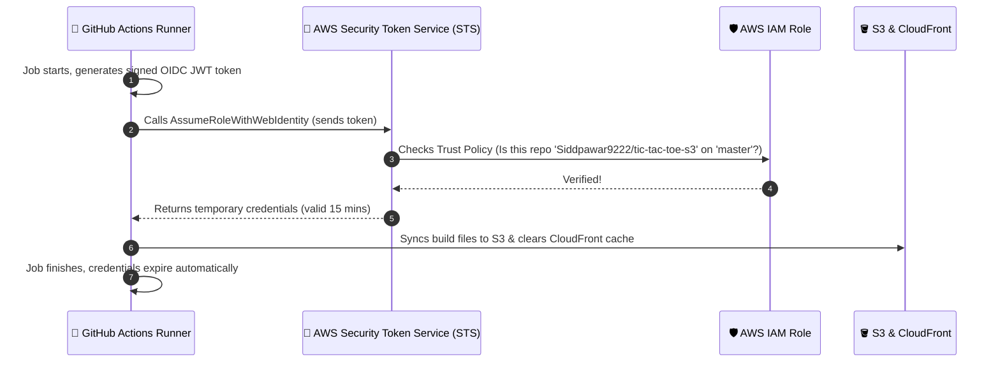

# 🧠 DevOps & Cloud Architecture: Concepts Explained in Plain English

This guide breaks down every cloud and DevOps concept used in this project. It is written in simple, conversational English with real-world analogies so that **anyone**—from beginners to interviewers—can understand how and why this architecture works.

---

## 📑 Table of Contents

1. [What Problem Are We Solving?](#1-what-problem-are-we-solving)
2. [Infrastructure as Code (IaC) & Terraform](#2-infrastructure-as-code-iac--terraform)
3. [Terraform State & Native S3 Locking](#3-terraform-state--native-s3-locking)
4. [DNS, BigRock & AWS Route 53](#4-dns-bigrock--aws-route-53)
   - [Why Did We Split Deployment into Two Phases?](#why-did-we-split-deployment-into-two-phases)
5. [SSL/TLS Certificates & AWS ACM](#5-ssltls-certificates--aws-acm)
   - [Why Does the Certificate Have to Live in `us-east-1`?](#why-does-the-certificate-have-to-live-in-us-east-1)
6. [Amazon S3: Private Static Asset Hosting](#6-amazon-s3-private-static-asset-hosting)
7. [Amazon CloudFront (CDN) & Origin Access Control (OAC)](#7-amazon-cloudfront-cdn--origin-access-control-oac)
8. [Single Page Application (SPA) Routing & Error Rewriting](#8-single-page-application-spa-routing--error-rewriting)
9. [Keyless CI/CD: GitHub Actions with OIDC](#9-keyless-cicd-github-actions-with-oidc)
10. [Summary Cheat Sheet](#10-summary-cheat-sheet)

---

## 1. What Problem Are We Solving?

When you build a modern React application, running `npm run build` produces static files: HTML, CSS, JavaScript, and images.

To make this website available worldwide, fast, and secure:
- ❌ **Traditional Approach:** Rent an expensive Linux EC2 server, install Nginx, set up SSL with Certbot, open firewall ports, and maintain OS patches.
- ✅ **Serverless Cloud Approach:** Store static files in Amazon S3, deliver them globally via CloudFront CDN, secure them with free AWS ACM SSL, and let Terraform configure everything automatically in minutes.

---

## 2. Infrastructure as Code (IaC) & Terraform

### 🍔 The Analogy
Imagine walking into a restaurant kitchen and manually cooking every burger yourself—clicking buttons in the AWS web console is like cooking by hand. It's slow, easy to forget an ingredient (like a missing firewall rule), and impossible to recreate identically.

**Infrastructure as Code (Terraform)** is like handing a chef a printed recipe card. You write down what you want in plain text (`main.tf`), and Terraform creates exact replicas in the cloud reliably, every single time.

### Why We Use Terraform Modules:
Instead of putting 500 lines of code into one file, we broke the code into smaller, reusable building blocks called **Modules**:
- `modules/route53`: Handles domain names.
- `modules/acm`: Handles SSL certificates.
- `modules/s3`: Handles file storage.
- `modules/cloudfront`: Handles global delivery.
- `modules/oidc`: Handles GitHub Actions security.

---

## 3. Terraform State & Native S3 Locking

### 📔 The Analogy
Terraform needs a **memory book** to remember what it built yesterday versus what exists today. That memory book is called `terraform.tfstate`.

If two team members run `terraform apply` at the exact same second, they might scribble in the memory book at the same time and ruin it.

### How We Solved It:
1. **Remote State in S3:** We store the state file safely in an encrypted Amazon S3 bucket (`react-tfstate-siddhesh-9821`) instead of on your local laptop.
2. **Native S3 Locking (`use_lockfile = true`):** In modern Terraform (version 1.10+), S3 has a built-in lock. When one person applies changes, Terraform locks the file. Anyone else trying to run it is told: *"Please wait, someone else is applying changes."* (No DynamoDB table required!).

---

## 4. DNS, BigRock & AWS Route 53

### 📖 The Analogy
Computers don't understand words like `geekysiddhesh.shop`; they only understand IP addresses like `13.249.98.54`.

**DNS (Domain Name System)** is the phonebook of the internet. It translates human names into computer IP addresses.

- **BigRock:** The store where you purchased your domain name (the registrar).
- **Route 53:** The smart AWS phonebook operator (the hosted zone) that connects visitors to your CloudFront CDN.

### Why Did We Split Deployment into Two Phases?

In our earlier version, Terraform tried to create the Route 53 Hosted Zone and request an SSL certificate at the exact same moment.

**The Problem:**
1. AWS gave you 4 NameServers (e.g., `ns-123.awsdns.com`).
2. But BigRock was still using its old nameservers.
3. AWS ACM asked: *"Hey internet, does this person really own geekysiddhesh.shop?"*
4. Because BigRock was not updated yet, the validation check failed and Terraform froze!

**The Clean Solution (Two Phases):**
- **Phase 1 (`environments/prod/dns`):** Creates **only** the Route 53 hosted zone and prints the 4 nameservers. You paste them into BigRock and wait 15 minutes.
- **Phase 2 (`environments/prod/infra`):** Now that BigRock points to AWS, Terraform creates ACM, CloudFront, and S3. Validation completes in under 2 minutes with zero errors!

---

## 5. SSL/TLS Certificates & AWS ACM

### 🔒 The Analogy
When you see `https://` and a green padlock in your browser, it means the connection between your computer and the website is encrypted. No hacker sitting on coffee shop Wi-Fi can spy on what you are doing.

**AWS Certificate Manager (ACM):**
- Provides free, auto-renewing SSL/TLS certificates.
- Validates ownership via DNS: It places a secret CNAME record in your Route 53 zone.

### Why Does the Certificate Have to Live in `us-east-1`?
CloudFront is a **global** service with hundreds of servers all over the world. AWS architecture requires that any certificate used by CloudFront **must be requested in the North Virginia (`us-east-1`) region**, regardless of where your S3 bucket or users are located. Our Terraform ACM module automatically configures this using an AWS provider alias.

---

## 6. Amazon S3: Private Static Asset Hosting

### 📦 The Analogy
Amazon S3 (Simple Storage Service) is like a giant, ultra-reliable digital hard drive in the cloud.

### Why is our bucket completely private?
In old tutorials, people turned on "Static Website Hosting" on S3 and made the whole bucket public.
- 🚨 **Risk:** Anyone can scan your S3 bucket, scrape files directly, or trigger bandwidth costs.
- 🛡️ **Our Secure Setup:** We block all public access (`block_public_acls = true`, `block_public_policy = true`). The outside world cannot touch the S3 bucket directly. They **must** go through CloudFront.

---

## 7. Amazon CloudFront (CDN) & Origin Access Control (OAC)

### 🚚 The Analogy
Imagine ordering shoes from a factory in Mumbai. If a customer in New York orders them, shipping takes a long time. But if the shoe company has local warehouses in New York, London, and Tokyo, the shoes arrive in 1 hour.

**CloudFront** is a Content Delivery Network (CDN) with hundreds of "Edge Locations" worldwide:
1. The first time someone in London visits `geekysiddhesh.shop`, CloudFront fetches the files from S3 in Mumbai (`ap-south-1`) and saves a copy in London.
2. The next 10,000 visitors in London get the files instantly from their local cache!

### What is Origin Access Control (OAC)?
OAC is a secure signature system. When CloudFront fetches files from your private S3 bucket, it digitally signs each request with AWS SigV4. The S3 bucket policy checks: *"Is this request coming from my specific CloudFront distribution? If yes, allow. If no, deny."*

---

## 8. Single Page Application (SPA) Routing & Error Rewriting

### 🏨 The Analogy
Imagine a hotel where only Room 1 (`index.html`) has a receptionist. If a guest walks directly to Room 404 (`/dashboard` or `/game`), they find a locked door because the physical file `game.html` does not exist on S3!

In React, there is only **one** real HTML file: `index.html`. React Router uses JavaScript inside the browser to fake different pages like `/leaderboard` or `/play`.

### The CloudFront Fix:
We configured CloudFront with Custom Error Responses:
```text
When S3 returns 403 (Forbidden) or 404 (Not Found):
➔ CloudFront rewrites the response to /index.html with status 200 OK.
```
This allows React to take over and render the right view without showing an ugly "File Not Found" error to your users.

---

## 9. Keyless CI/CD: GitHub Actions with OIDC

### 🏨 The Analogy
- **Old Static Keys (`AWS_ACCESS_KEY_ID`):** Like giving your friend a heavy iron master key to your front door. If they lose it, anyone can rob your house. You have to change the locks.
- **OIDC (OpenID Connect):** Like a smart hotel keycard. The hotel front desk checks your passport, hands you a temporary card that only opens your room, and it self-destructs after 15 minutes.



### Why This is Industry Best Practice:
1. **Zero Secret Leakage:** No AWS credentials are stored in your GitHub repository settings.
2. **Scoped Down Permissions:** The IAM role can *only* upload to this one S3 bucket and invalidate this one CloudFront distribution. It cannot create servers, delete databases, or touch anything else.

---

## 10. Summary Cheat Sheet

| Component | What It Does | Analogy |
| :--- | :--- | :--- |
| **Terraform** | Builds all AWS resources automatically from code | Recipe card for a chef |
| **Bootstrap S3** | Safely stores Terraform memory & prevents conflicts | Encrypted shared notebook with a lock |
| **BigRock** | Domain name seller/registrar | The store where you bought the domain |
| **Route 53** | Directs internet traffic to the right server | Internet phonebook |
| **ACM** | Generates free SSL/TLS certificates for HTTPS | Passport verifying your identity |
| **Amazon S3** | Stores static React build files privately | High-security private warehouse |
| **CloudFront** | Delivers website files from local edge caches globally | Local delivery hubs around the world |
| **OAC** | Lets only CloudFront access private S3 bucket | Security guard checking badges at the gate |
| **OIDC** | Authenticates GitHub Actions without permanent keys | Temporary 15-minute hotel keycard |

