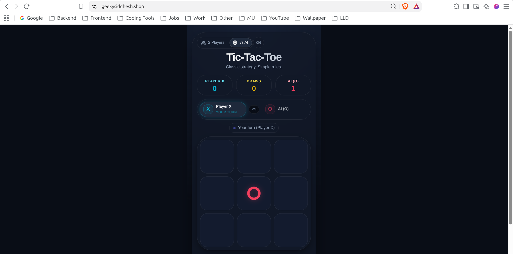
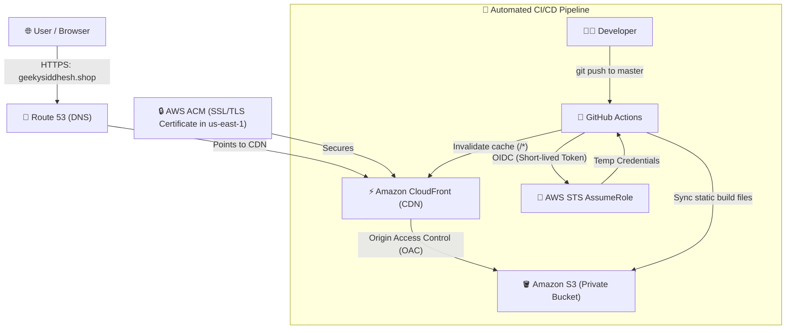
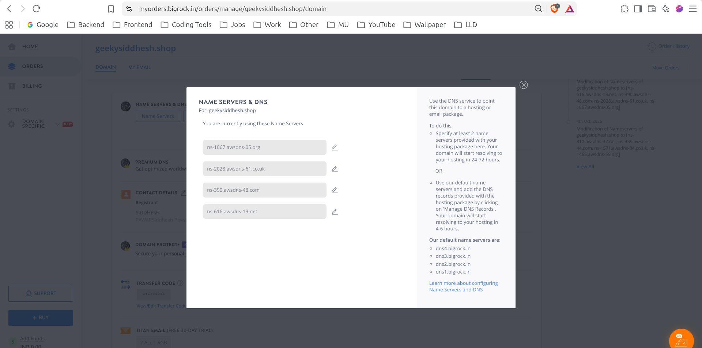
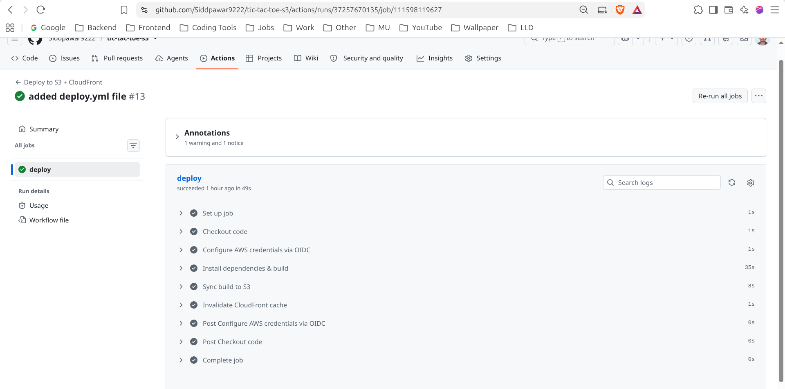
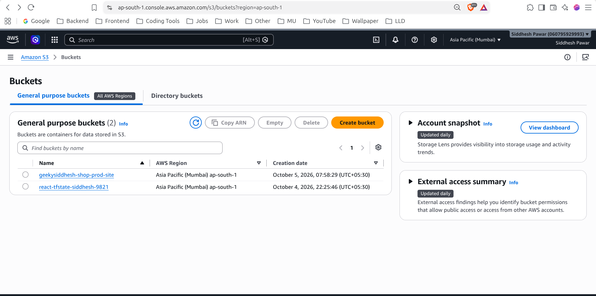
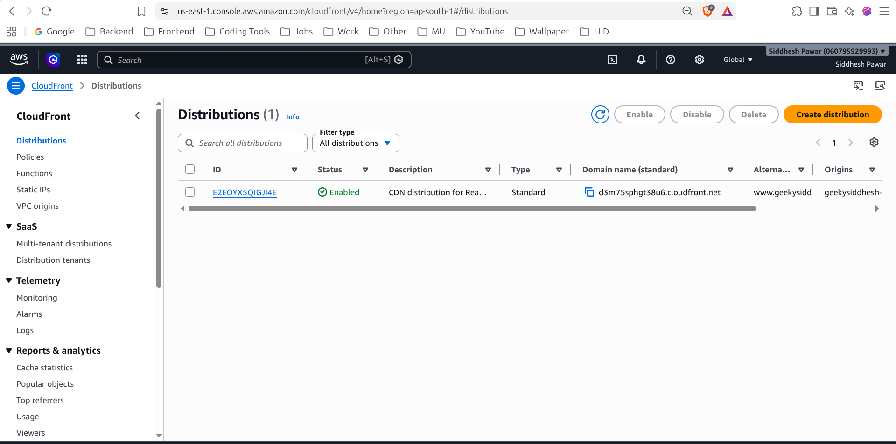
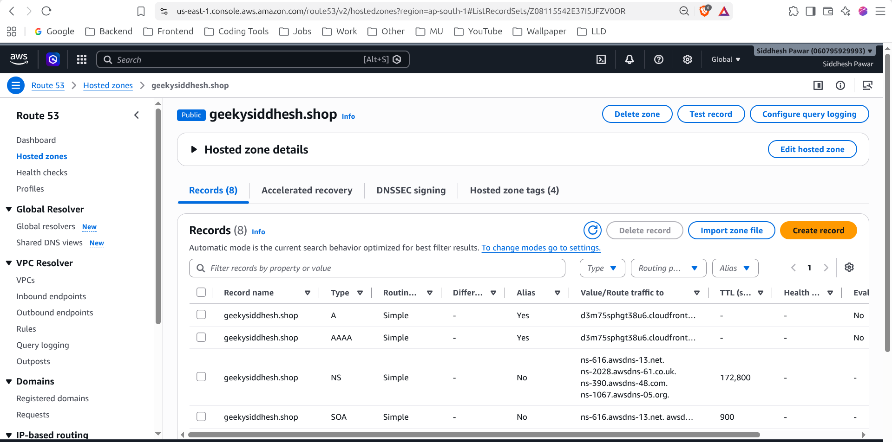
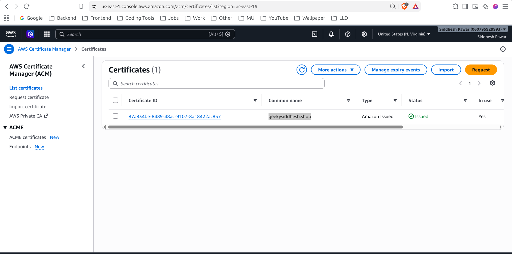

# 🚀 Production React Deployment on AWS (Terraform + GitHub Actions OIDC)

A fully automated, production-grade cloud infrastructure for hosting a Single Page Application (React) on AWS. Built using **Terraform (Infrastructure as Code)** and deployed via **GitHub Actions** using **OIDC (Keyless Security)**.

---

## 🌐 Live Website

- **Production URL:** [https://geekysiddhesh.shop](https://geekysiddhesh.shop)
- **Subdomain:** [https://www.geekysiddhesh.shop](https://www.geekysiddhesh.shop)



---

## 🏛️ Architecture Overview

Traffic flows securely from the user's browser through CloudFront edge locations, served from a private S3 bucket, with DNS and SSL managed automatically by AWS.



---

## ✨ Key Features

1. **Two-Phase Clean Terraform Deployment:**
   - **Phase 1 (`dns`):** Creates Route 53 Hosted Zone first, allowing you to update registrar (BigRock) NameServers with zero waiting or validation hangs.
   - **Phase 2 (`infra`):** Deploys S3, ACM SSL certificate, CloudFront, and IAM OIDC without conditional toggles or duplicate zones.
2. **Zero Long-Lived Credentials (OIDC):**
   - No static `AWS_ACCESS_KEY_ID` or `AWS_SECRET_ACCESS_KEY` stored in GitHub.
   - Uses GitHub Actions OpenID Connect (OIDC) to assume an IAM role with short-lived (~15 min) credentials.
3. **High Performance & Global Caching:**
   - Amazon CloudFront edge locations serve static content worldwide with HTTP/2 and HTTP/3 support.
4. **Strong Security:**
   - S3 bucket is **100% private** (all public access blocked).
   - Only CloudFront can read files from S3 using **Origin Access Control (OAC)**.
5. **Single Page Application (SPA) Support:**
   - Custom CloudFront error responses map `403` and `404` errors to `/index.html` with HTTP `200`, ensuring client-side React routes work seamlessly on page reload.
6. **Modern Terraform State with Native S3 Locking:**
   - Uses Terraform >= 1.10 native S3 conditional write locking (`use_lockfile = true`), eliminating the need for a separate DynamoDB table.

---

## 📁 Repository Structure

```text
.
├── screenshots/                     # Project screenshots
│   ├── live-website.png             # Working site at https://geekysiddhesh.shop
│   ├── bigrock-nameservers.png      # BigRock NameServers configuration
│   ├── github-actions-success.png   # Successful CI/CD pipeline run
│   ├── aws-s3-buckets.png           # S3 state & website buckets
│   ├── aws-cloudfront-distribution.png # Active CloudFront CDN distribution
│   ├── aws-route53-hostedzone.png   # Route 53 DNS records
│   └── aws-acm-certificate.png      # Issued SSL/TLS Certificate
├── CONCEPTS.md                      # Detailed plain-English concept guide
├── README.md                        # Project documentation & setup manual
└── terraform/
    ├── bootstrap/                   # S3 Bucket for remote state & locking (run once)
    │   ├── main.tf
    │   ├── outputs.tf
    │   ├── providers.tf
    │   └── variables.tf
    ├── modules/                     # Reusable Terraform Modules
    │   ├── acm/                     # SSL/TLS Certificate in us-east-1 + DNS validation
    │   ├── cloudfront/              # CDN distribution, OAC, and Route 53 DNS records
    │   ├── oidc/                    # IAM OIDC Role & least-privilege deployment policy
    │   ├── route53/                 # Route 53 Hosted Zone & NameServer outputs
    │   └── s3/                      # Private S3 static website bucket + bucket policy
    └── environments/
        └── prod/
            ├── dns/                 # Phase 1: DNS & NameServers setup
            │   ├── main.tf
            │   ├── outputs.tf
            │   ├── providers.tf
            │   ├── terraform.tfvars
            │   └── variables.tf
            └── infra/               # Phase 2: Core Infrastructure (S3, CDN, SSL, OIDC)
                ├── main.tf
                ├── outputs.tf
                ├── providers.tf
                ├── terraform.tfvars
                └── variables.tf
```

---

## 📋 Prerequisites

Before deploying, ensure you have:
1. **[AWS Account](https://aws.amazon.com/)** with admin privileges configured locally (`aws configure`).
2. **[Terraform CLI](https://developer.hashicorp.com/terraform/downloads)** (>= 1.10 recommended).
3. **Domain Name** registered at a registrar (e.g. BigRock, Namecheap, GoDaddy).
4. **GitHub Repository** containing your React app (e.g. `Siddpawar9222/tic-tac-toe-s3`).

---

## 🛠️ Step-by-Step Deployment Guide

### Step 0: Remote State Backend (Run Once)

Initializes the remote S3 bucket for storing Terraform state with encryption and locking.

```bash
cd terraform/bootstrap
terraform init
terraform apply
```

---

### Step 1: DNS Bootstrap (Phase 1)

Creates the Route 53 hosted zone and outputs your 4 AWS NameServers.

```bash
cd ../environments/prod/dns
terraform init
terraform apply
```

After `terraform apply` finishes, you will see output like:
```text
Outputs:
name_servers = [
  "ns-616.awsdns-13.net",
  "ns-2028.awsdns-61.co.uk",
  "ns-390.awsdns-48.com",
  "ns-1067.awsdns-05.org",
]
```

#### Update BigRock DNS:
1. Log in to **BigRock** ➔ **Manage Orders** ➔ Click on your domain (`geekysiddhesh.shop`).
2. Go to **Name Servers** settings.
3. Replace the default BigRock nameservers with the **4 AWS Route 53 NameServers** from the output above.
4. Save and wait **15–30 minutes** for DNS propagation.



#### Verify Propagation:
Run this command from your terminal to verify:
```bash
dig NS geekysiddhesh.shop +short @8.8.8.8
```
When you see your AWS nameservers returned, proceed to Step 2.

---

### Step 2: Core Infrastructure (Phase 2)

Provisions the ACM SSL certificate, S3 bucket, CloudFront distribution, and OIDC IAM role.

```bash
cd ../infra
terraform init
terraform apply
```

Since BigRock is already delegated to Route 53, the ACM DNS validation records are verified quickly without hanging.

---

### Step 3: Configure GitHub Actions CI/CD

#### 1. Retrieve Terraform Outputs
From your `terraform/environments/prod/infra` directory, run:
```bash
terraform output
```

Note down these values:
- `github_actions_role_arn`
- `s3_bucket_name`
- `cloudfront_distribution_id`

#### 2. Add GitHub Repository Secrets
Go to your GitHub repository:  
**Settings ➔ Secrets and variables ➔ Actions ➔ New repository secret**

Add the following 4 secrets:

| Secret Name | Example Value | Description |
| :--- | :--- | :--- |
| `AWS_ROLE_ARN` | `arn:aws:iam::123456789012:role/github-actions-frontend-deploy` | IAM role assumed via OIDC |
| `AWS_REGION` | `ap-south-1` | Primary AWS region |
| `S3_BUCKET` | `geekysiddhesh-shop-prod-site` | Target S3 bucket name |
| `CF_DISTRIBUTION_ID` | `E2EOYX5QIGJI4E` | CloudFront Distribution ID for cache invalidation |

#### 3. GitHub Actions Workflow File
In your React project repository (`tic-tac-toe-s3`), create `.github/workflows/deploy.yml`:

```yaml
name: Build and Deploy to AWS

on:
  push:
    branches: [master]

permissions:
  id-token: write   # Required for requesting OIDC JWT token
  contents: read    # Required for actions/checkout

jobs:
  deploy:
    name: Build & Deploy
    runs-on: ubuntu-latest

    steps:
      - name: Checkout Code
        uses: actions/checkout@v4

      - name: Setup Node.js
        uses: actions/setup-node@v4
        with:
          node-version: 18
          cache: "npm"

      - name: Install Dependencies
        run: npm ci

      - name: Build Application
        run: npm run build

      - name: Configure AWS Credentials (via OIDC)
        uses: aws-actions/configure-aws-credentials@v4
        with:
          role-to-assume: ${{ secrets.AWS_ROLE_ARN }}
          aws-region: ${{ secrets.AWS_REGION }}

      - name: Sync Static Assets to S3 (Cache 1 year)
        run: |
          aws s3 sync ./build s3://${{ secrets.S3_BUCKET }} \
            --delete \
            --cache-control "public,max-age=31536000,immutable"

      - name: Upload index.html (No-Cache for SPA updates)
        run: |
          aws s3 cp ./build/index.html s3://${{ secrets.S3_BUCKET }}/index.html \
            --cache-control "no-cache,no-store,must-revalidate"

      - name: Invalidate CloudFront Cache
        run: |
          aws cloudfront create-invalidation \
            --distribution-id ${{ secrets.CF_DISTRIBUTION_ID }} \
            --paths "/*"
```

Push any commit to your `master` branch. GitHub Actions will automatically authenticate with AWS via OIDC, upload the build to S3, and refresh CloudFront!



---

## 🔍 Verification & AWS Console Gallery

### 1. Terminal Health Checks
Once deployed, run these quick checks from your terminal:

```bash
# 1. Check DNS resolution
dig A geekysiddhesh.shop +short

# 2. Check HTTP to HTTPS redirection
curl -I http://geekysiddhesh.shop

# 3. Check CloudFront headers & SSL
curl -I https://geekysiddhesh.shop
```

Expected headers include:
- `HTTP/2 200`
- `Server: CloudFront`
- `x-cache: Hit from cloudfront` (on repeat visits)

---

### 2. AWS Management Console Verification

#### 🪣 Amazon S3: Remote State & Static Website Buckets
The `react-tfstate-siddhesh-9821` bucket manages Terraform remote state, while `geekysiddhesh-shop-prod-site` houses the static React files. All public access is blocked; content is accessible only through CloudFront OAC.


#### ⚡ Amazon CloudFront: Global CDN Distribution
Active CloudFront distribution (`E2EOYX5QIGJI4E`) with alternate domain name (`www.geekysiddhesh.shop`), SSL termination, and SPA custom error page rewriting (`/index.html`).


#### 📍 Amazon Route 53: Hosted Zone & DNS Records
Public hosted zone for `geekysiddhesh.shop` containing 8 records including IPv4 (`A`) and IPv6 (`AAAA`) aliases targeting CloudFront, plus NS and SOA records.


#### 🔒 AWS Certificate Manager (ACM): SSL/TLS Certificate
Public SSL/TLS certificate issued for `geekysiddhesh.shop` in `us-east-1` with DNS validation verified and in active use by CloudFront.


---

## 🧹 Teardown / Cleanup

If you ever wish to destroy all AWS resources to avoid ongoing costs:

```bash
# Step 1: Destroy core infrastructure
cd terraform/environments/prod/infra
terraform destroy

# Step 2: Destroy DNS hosted zone (remember to switch BigRock nameservers first)
cd ../dns
terraform destroy

# Step 3: Destroy state bucket (if you want to completely clean up)
cd ../../../bootstrap
terraform destroy
```

---

## 📚 Deep Dive: Learn the Architecture

Want to understand **why** we chose these services and **how** they work under the hood?  
Read the beginner-friendly companion guide:  
👉 **[CONCEPTS.md](CONCEPTS.md)**
